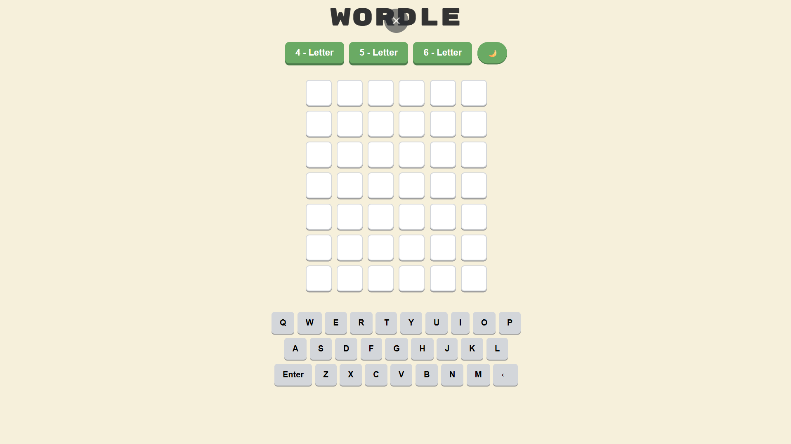
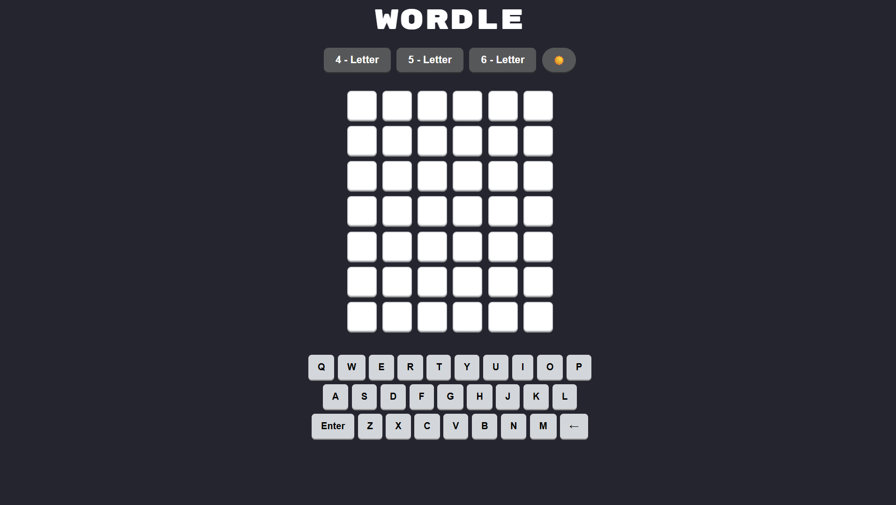

# Wordle Clone 🎯

A feature-rich, animated Wordle clone built with **JavaScript, HTML, CSS**, and **GSAP**, bundled with **Parcel** and hosted using **GitHub Pages**.

👉 **[Play it Live](https://basit-ayub.github.io/wordle/)**

---

## 🌟 Features

- 🟢 4–6 letter words
- 🌓 Light/Dark mode toggle
- 🔤 Dictionary-validated guesses
- 🎉 Graffiti + bounce animations on win
- ❌ Shake animation for invalid guesses
- 🧠 Smooth tile reveal + transitions
- 🖱️ Works with physical & virtual keyboard

---

## 🖼️ Screenshots

### 🔆 Light Mode

### 🌙 Dark Mode

### 🎉 Win Animation

---

